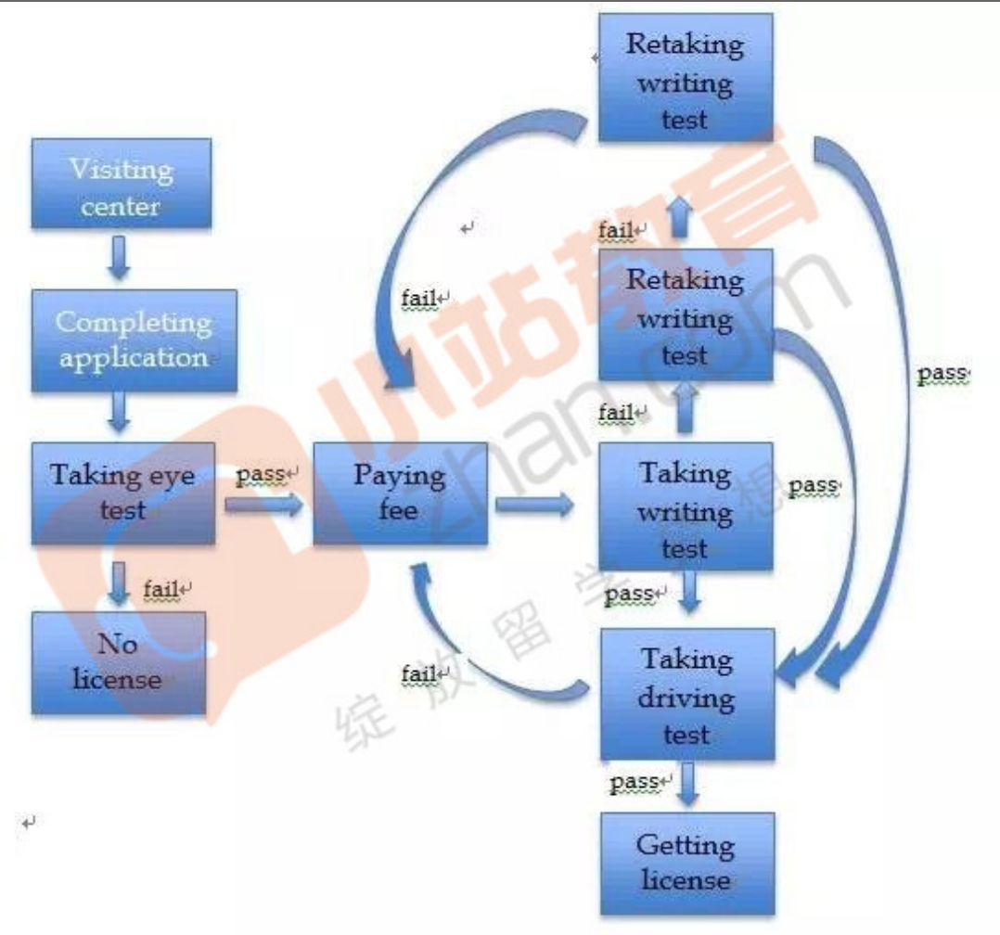

[🔙 Back to List](../index.md)

## Reqiurement
The diagrams below show the process of applying for a driver license in America.

## Article
The digrams above illustrate how to apply for a driver license in America.

First of all, the applicant should go to the center and complete a application form. After that, an eye test is performed to make sure that the applicant meet the eyesight requirement of acquiring a driver license. If the applicant fails in the test, he won't have any chance to obtain a driver license. If his eyesight is good enough, then he can pay the fee and enter the formal test process.

There are two tests, which the applicant should passed one by one to get a license. The first test is writing test and the applicant have 3 chances to pass it. The following test is driving test, in which the applicant has only one chance. Having passed both of the tests, the applicant can get the driver license, or he failed and need to pay the fee again to retry these two tests.

