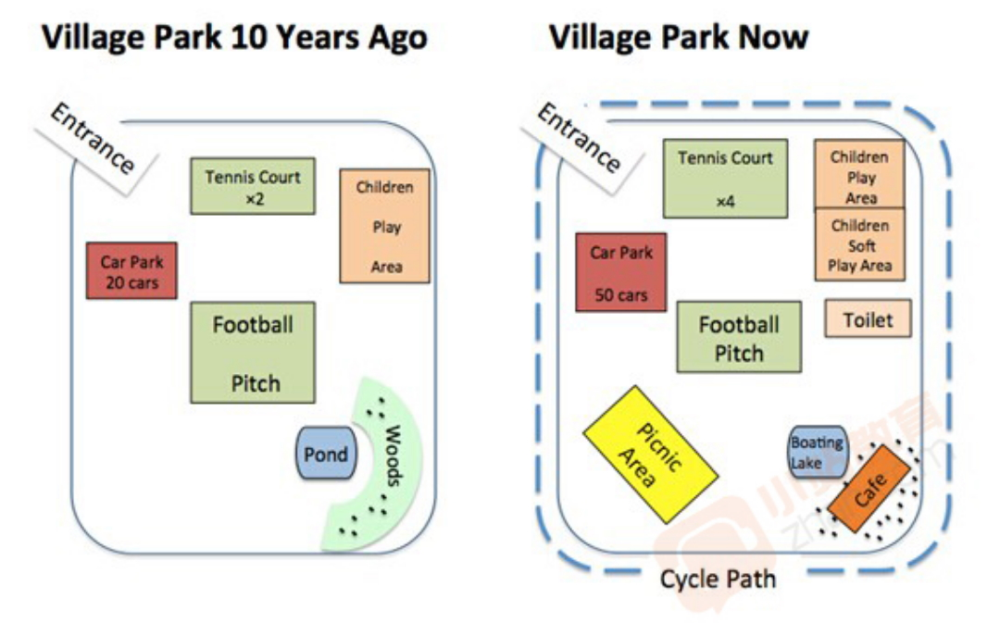

[🔙 Back to List](../index.md)

## Reqiurement
The diagrams below show the changes that has tanken place in a village park.

## Article
The maps illustrate the changes of a village park in a decade.

10 years ago, the village park was just partly deveploped. The entrance was located at the north-west corner of the park. To the south of the entrance, there was a car park which can contain 20 cars totally. A football pitch was in the central part of the park and 2 tennis courts were located in the north of the park.
In the north-east part, there was a children play area.
The south part of the park was undeveloped at that time and there was a pond in the east with woods on the east side of it.

One decade later, now, the car park is expanded and can contain up to 50 cars. The number of tennis courts is doubled. And the children play area is divided to two parts, one of which is transformed to children soft play area. There is a new toilet built near them. 

In the south part of the park, there is a new picnic area in the south-west corner and a new cafe in the woods. Besides, there is a newly built cycle path around the park.